# 🛒 Real-Time Retail Analytics Platform

## End-to-End Data Engineering & Analytics Project

**Apache Kafka → Apache Spark Structured Streaming → PostgreSQL → dbt → Streamlit**

---

## 📌 Project Summary

This project implements a complete real-time retail analytics pipeline that simulates retail transactions, streams them through Kafka, processes them using Apache Spark Structured Streaming, stores them in PostgreSQL, transforms them using dbt, and visualizes business insights through an interactive Streamlit dashboard.

The project was developed as part of a Data Analytics / Data Engineering internship and demonstrates modern data engineering practices including:

- Real-time data ingestion
- Stream processing
- Data warehousing
- Data modeling with dbt
- Query optimization
- Data quality validation
- Database security controls
- Interactive business intelligence dashboards

---

## 🎯 Internship Deliverables Status

| Deliverable | Status |
|------------|---------|
| Real-Time Data Pipeline | ✅ Completed |
| PostgreSQL Data Warehouse | ✅ Completed |
| dbt Transformation Models | ✅ Completed |
| Streamlit Dashboard | ✅ Completed |
| Query Optimization Report | ✅ Completed |
| Data Quality Validation | ✅ Completed |
| Security Demonstration | ✅ Completed |
| Project Documentation | ✅ Completed |

---

## 🏗️ Architecture

```text
Retail Transaction Producer
            │
            ▼
      Apache Kafka
            │
            ▼
Apache Spark Streaming
            │
            ▼
       PostgreSQL
      Data Warehouse
            │
            ▼
            dbt
    Transformation Layer
            │
            ▼
   Streamlit Dashboard
```

---

## ⚙️ Technology Stack

| Layer | Technology |
|---------|------------|
| Programming Language | Python |
| Streaming Platform | Apache Kafka |
| Stream Processing | Apache Spark Structured Streaming |
| Data Warehouse | PostgreSQL |
| Data Transformation | dbt |
| Dashboard | Streamlit |
| Data Quality | Custom Validation Framework |
| Query Optimization | PostgreSQL Indexing |
| Version Control | Git & GitHub |

---

# 🚀 Core Features

## Real-Time Streaming Pipeline

- Python transaction producer
- Kafka event streaming
- Spark Structured Streaming consumer
- Near real-time ingestion into PostgreSQL

## Data Warehouse

Centralized PostgreSQL warehouse storing:

- Transaction data
- Product data
- Revenue data
- Historical analytics data

## dbt Transformation Layer

### Silver Layer

- `stg_transactions`

### Gold Layer

- `product_sales`
- `daily_sales`
- `product_performance`

## Interactive Dashboard

The Streamlit dashboard provides:

- Real-time KPIs
- Revenue monitoring
- Product performance analytics
- Revenue trends
- Top-selling products
- Live transaction feed

## Data Quality Validation

Implemented validation checks:

- transaction_id_not_null
- customer_id_not_null
- quantity_positive
- price_positive
- valid_products

## Query Optimization

Performance improvements achieved using:

- Product indexing
- Time-based indexing
- Execution plan analysis
- EXPLAIN ANALYZE benchmarking

Security Demonstration:

Role-based access control was implemented at the PostgreSQL warehouse level.

Regional Managers can access only regional data.
National Managers can access all warehouse data.

Screenshots demonstrating both roles are included in:

docs/deliverables/security_demo/

# 📸 Project Evidence

## dbt DAG

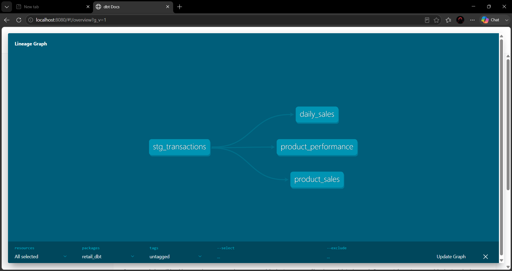

---

## Data Models

### Staging Model

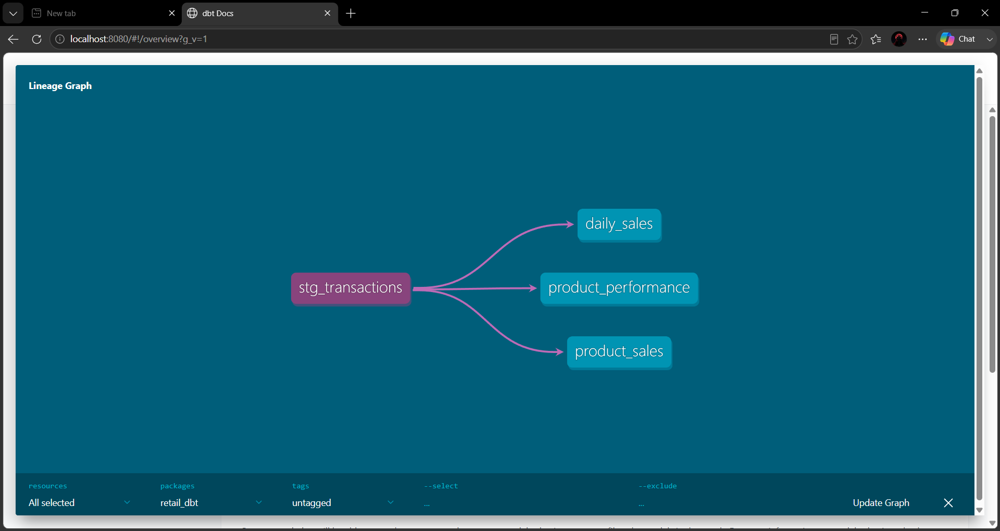

### Product Sales Model

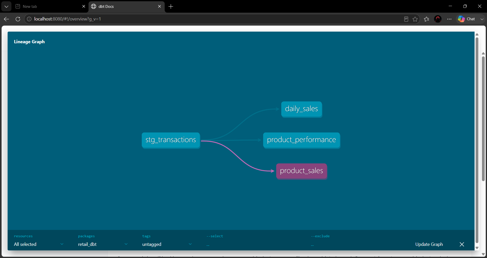

### Daily Sales Model

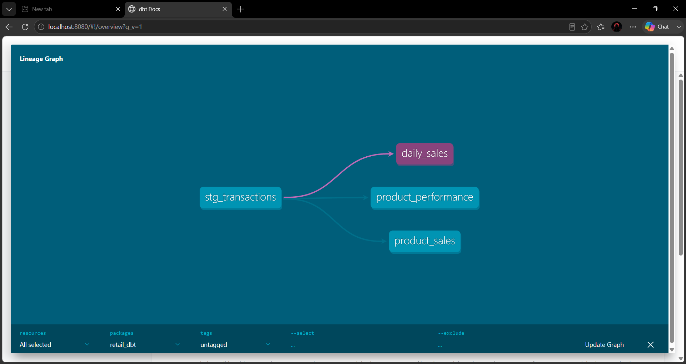

### Product Performance Model

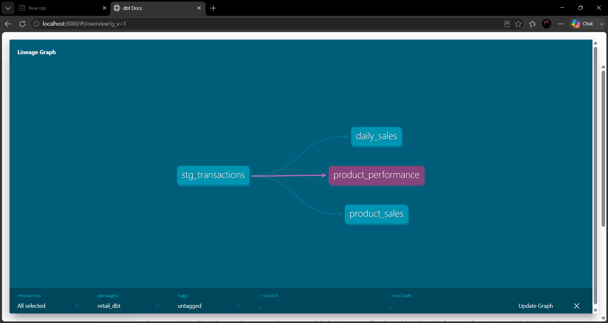

---

## Dashboard Screenshots

### Dashboard Overview

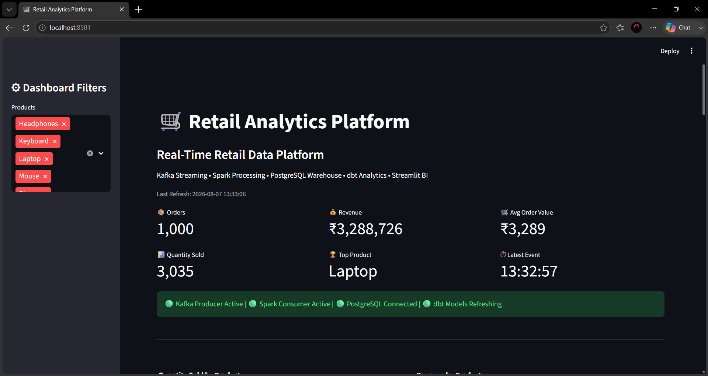

### Product Analytics

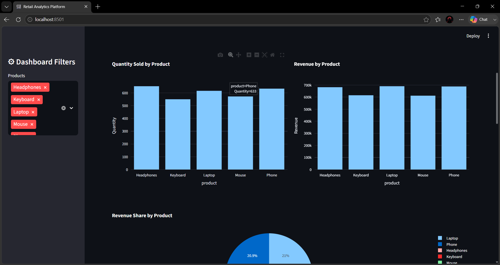

### Product Analytics (Additional View)

.png)

### Live Transaction Feed

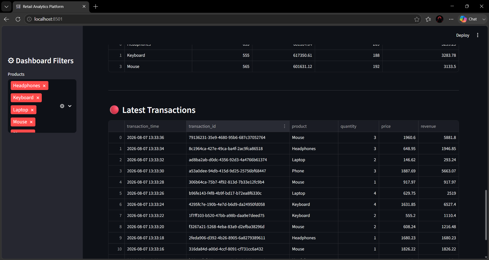

---

## Query Optimization Evidence

### Product Query Before Optimization

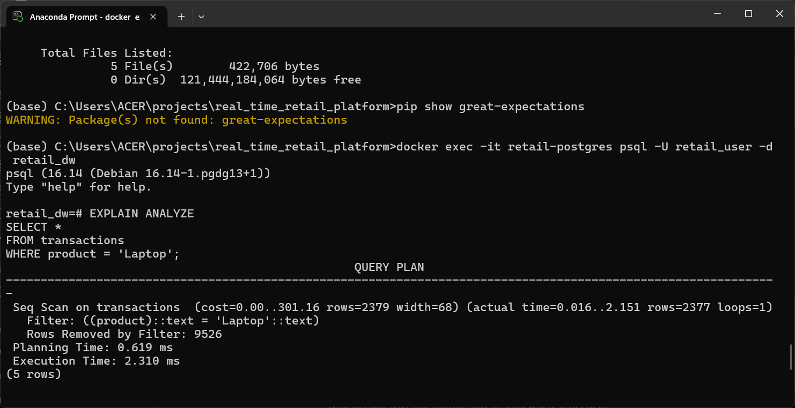

### Product Query After Optimization

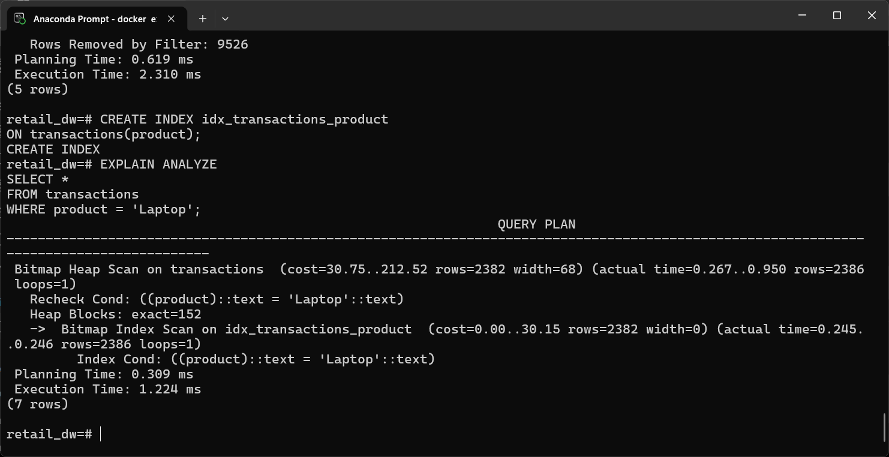

### Time-Based Query Optimization

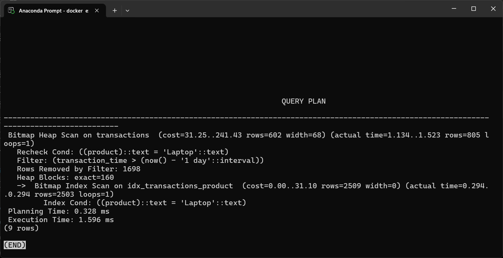

### Recent Transactions Query

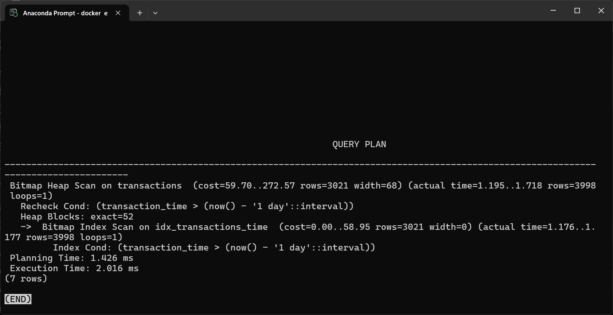

### Revenue Aggregation Query

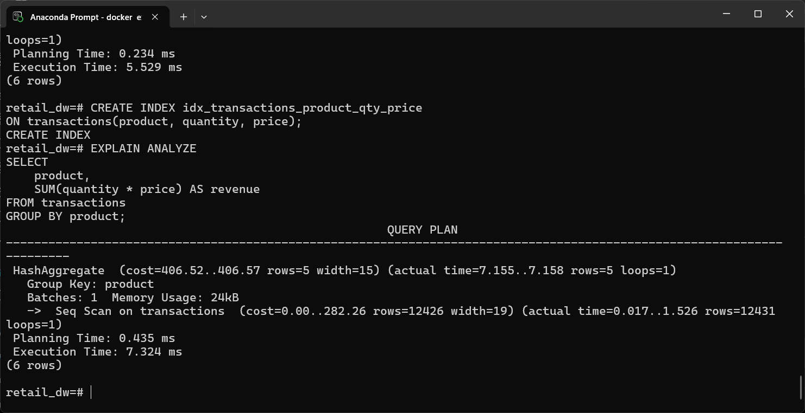

---

# 📊 Data Quality Report

Location:

`docs/deliverables/data_quality/data_quality_report.csv`

Checks executed:

- transaction_id_not_null
- customer_id_not_null
- quantity_positive
- price_positive
- valid_products

Result: ✅ All checks passed

---

# ⚡ Query Optimization Report

Location:

`docs/deliverables/performance_report/query_optimization_report.md`

Includes:

- Baseline query performance
- Index creation
- Execution plan analysis
- Before vs After comparison
- Performance improvement summary

---

# 🔒 Security Demonstration

Location:

`docs/deliverables/security_demo/`

Includes:

- Regional Manager access demonstration
- National Manager access demonstration
- Security validation report

---

# ▶️ Running The Project

## Start PostgreSQL

```bash
docker start retail-postgres
```

## Start Zookeeper

```bash
zookeeper-server-start.bat config/zookeeper.properties
```

## Start Kafka

```bash
kafka-server-start.bat config/server.properties
```

## Start Producer

```bash
python producer/producer.py
```

## Start Spark Consumer

```bash
python spark_jobs/stream_consumer.py
```

## Run dbt Models

```bash
dbt run
```

## Launch Dashboard

```bash
streamlit run streamlit_app/app.py
```

---

## 📁 Repository Structure

```text
real_time_retail_platform
│
├── docs/
│   ├── screenshots/
│   └── deliverables/
│
├── producer/
├── spark_jobs/
├── retail_dbt/
├── streamlit_app/
├── quality_checks/
│
├── scripts/
├── superset/
├── superset_config/
│
├── docker-compose.yml
├── retail_backup.sql
├── README.md
├── ARCHITECTURE.md
├── PROJECT_TRACKER.md
└── REQUIREMENTS_MATRIX.md
```
---

# 👨‍💻 Author

**Shabbir Rajgarh Wala**

Bachelor of Computer Applications (BCA)

Shri Vaishnav Institute of Management & Science (SVIMS), Indore

Data Analytics Internship Project

2026

---

## 📌 Internship Submission Note

This repository contains all required deliverables including:

- Working real-time data pipeline
- dbt transformation models
- Interactive analytics dashboard
- Query optimization report
- Data quality validation report
- Security demonstration
- Supporting screenshots and documentation

All project components were successfully executed and verified locally.
